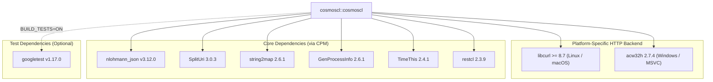

# Project Dependencies

This document is automatically generated from `CMakeLists.txt` files for `cosmoscl`.

## Dependency Diagram

## Dependency Breakdown

| Dependency | Repository / Target | Version | Type | Scope / Platform |
| :--- | :--- | :--- | :--- | :--- |
| **libcurl** | `System / CURL` | >= 8.7 | `find_package` | Linux / macOS (GCC, Clang, AppleClang) |
| **acw32h** | [`SiddiqSoft/acw32h`](https://github.com/SiddiqSoft/acw32h) | 2.7.4 | `CPM` | Windows (MSVC) |
| **nlohmann_json** | [`nlohmann/json`](https://github.com/nlohmann/json) | v3.12.0 | `CPM` | All Platforms (`INTERFACE`) |
| **SplitUri** | [`SiddiqSoft/SplitUri`](https://github.com/SiddiqSoft/SplitUri) | 3.0.3 | `CPM` | All Platforms (`INTERFACE`) |
| **string2map** | [`SiddiqSoft/string2map`](https://github.com/SiddiqSoft/string2map) | 2.6.1 | `CPM` | All Platforms (`INTERFACE`) |
| **GenProcessInfo** | [`SiddiqSoft/GenProcessInfo`](https://github.com/SiddiqSoft/GenProcessInfo) | 2.6.1 | `CPM` | All Platforms (`INTERFACE`) |
| **TimeThis** | [`SiddiqSoft/TimeThis`](https://github.com/SiddiqSoft/TimeThis) | 2.4.1 | `CPM` | All Platforms (`INTERFACE`) |
| **restcl** | [`SiddiqSoft/restcl`](https://github.com/SiddiqSoft/restcl) | 2.3.9 | `CPM` | All Platforms (`INTERFACE`) |
| **googletest** | [`google/googletest`](https://github.com/google/googletest) | v1.17.0 | `CPM` | Test Target Only (`BUILD_TESTS=ON`) |
