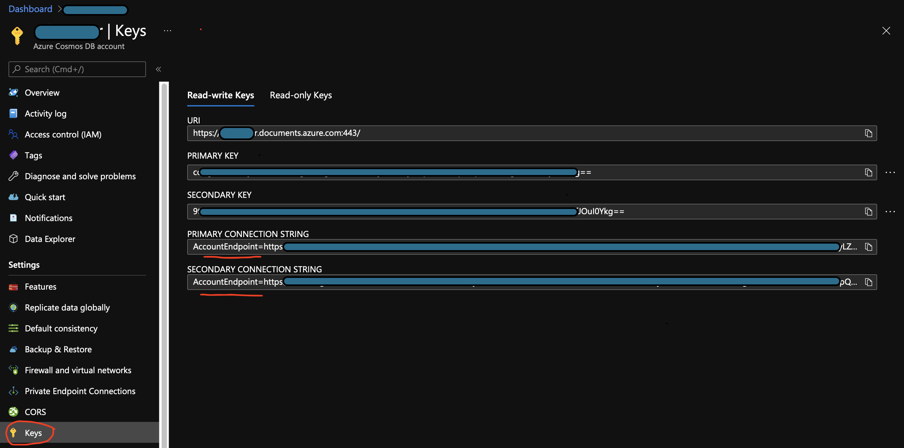

@mainpage CosmosClient : Azure Cosmos REST-API Client for Modern C++
@copyright &copy;2021 Siddiq Software LLC.
@author siddiqsoft
@version 0.1.0

<!-- badges -->
[](https://github.com/SiddiqSoft/CosmosClient/actions/workflows/codeql-analysis.yml)
[](https://dev.azure.com/siddiqsoft/siddiqsoft/_build/latest?definitionid=15&branchName=main)


<!-- end badges -->

@tableofcontents

# Features
- C++20 Azure Cosmos REST API client.
  - Be instructive *and* functional.
  - Low-overhead--just not optimized.
  - C++20 sugarcoating
- JSON everywhere; configuration, I/O, results.
- Simple interface -- this means we limit the options you can fiddle
- Implement the SQL REST API
  - All of the responses are JSON documents as returned from Azure Cosmos. We do not abstract/encapsulate unless there is value.
  - Implement Azure REST API best practices.
- Single header
- Use Microsoft Win32 API for IO, encryption
  - Dependency on [nlohmann.json](https://github.com/nlohmann/json)
    - The best interface
  - Dependency on [azure-cpp-utils](https://github.com/siddiqsoft/azure-cpp-utils) our own library.
    - We do not implement any encryption functions. We only add a thin modern C++ coating on the underlying Win32 SDK.
  - Dependency on [restcl](https://github.com/siddiqsoft/restcl) our own library.
    - Again, we wrap a modern C++ sugar coat on the Win32 WinHTTP library. Nothing overly heavy or force you to use std::wstring or invent yet-another-string!
- Simplicity and ease of use--focus on your problem set and let the libraries evolve.

# API

<table>
<tr>
<th align=left colspan=2>siddiqsoft::CosmosClient</th>
</tr>
<tr><th>Function</th><th>Description</th></tr>

<tr>
<td>siddiqsoft::CosmosClient::configure</td>
<td>Configure the client</td>
</tr>

<tr>
<td>siddiqsoft::CosmosClient::configuration</td>
<td>Returns the current configuration object</td>
</tr>

<tr>
<td>siddiqsoft::CosmosClient::listDatabases</td>
<td>Lists databases for the given Connection String</td>
</tr>
<tr><td>siddiqsoft::CosmosClient::listCollections</td>
<td>Lists collections for the given database</td>
</tr>
<tr><td>siddiqsoft::CosmosClient::listDocuments</td>
<td>Lists all documents within given collection</td>
</tr>
<tr><td>siddiqsoft::CosmosClient::discoverRegions</td>
<td>Fetch the service settings for the given connection string</td>
</tr>
<tr><td>siddiqsoft::CosmosClient::create</td>
<td>Synchronous. Create a json document in the collection</td>
</tr>
<tr><td>siddiqsoft::CosmosClient::upsert</td>
<td>Synchronous. Create a json document in the collection</td>
</tr>
<tr><td>siddiqsoft::CosmosClient::update</td>
<td>Synchronous. Create a json document in the collection</td>
</tr>
<tr><td>siddiqsoft::CosmosClient::find</td>
<td>Synchronous. Create a json document in the collection</td>
</tr>
<tr><td>siddiqsoft::CosmosClient::query</td>
<td>Synchronous. Create a json document in the collection</td>
</tr>
<tr><td>siddiqsoft::CosmosClient::remove</td>
<td>Synchronous. Remove json document given doc id from the collection</td>
</tr>
</table>

# Getting Started

- Get yourself Visual Studio 2019 v16.11 (we require C++20) with C++ workload
- Clone this repository
- Open the solution CosmosClient.sln
- The environment variables must be set a the system-level (VS may need to be restarted)
- Builds in x64 mode.

You can start saving your documents in Cosmos with just 3 lines of code!
1. Declare the instance
2. Configure with json via `configure`.
3. Make call to `create`

## Configuration


We use JSON object to configure the client.

Field      | Type  | Description
-----------|-------|-----------------
`apiVersion` | string | Do not alter as this is "global". Fixed internally by the library `2018-12-31`.
`connectionStrings` | array of strings | Each entry must be the Connection String entry for the Cosmos db obtained from the Azure Cosmos Portal.<br/>WARNING: Only the first two elements are suppported.<br/>0 - Primary Connection String<br/>1 - Secondary Connection String
`partitionKeyNames` | array of strings | Each entry is the element within your document corresponding to your configured partitionkey in the Azure Cosmos Portal.

```json
{
    "apiVersion": "2018-12-31",
    "connectionStrings": [],
    "partitionKeyNames": []
}
```

> When you invoke `cosmosClient.configure( myConfig );` the contents of your `myConfig` json object are merged/replace the defaults. 
As a user, you need only provide: `connectionStrings` and the `partitionKeyName`.



## Sample

```cpp
#include "nlohmann/json.hpp"
#include "siddiqsoft/azure-cosmos-restcl.hpp"

// See the example1 test for full source code
// Code here has been trimmed for brevity.
void example1(const std::string& p, const std::string& s)
{
    // You should maintain one instance for each Cosmos service
    // It is advised to maintain a single instance per runtime (exe/dll/service)
    siddiqsoft::CosmosClient cc;

    // If you provide valid information, this will configure by probing Azure for
    // region information and sets up the read and write locations.
    // We use JSON object as the primary configuration interface.
    // The items you provide are muxed with the defaults so you can provide as much
    // or as little as the following elements.
    cc.configure({{"partitionKeyNames", {"__pk"}},
                  {"connectionStrings", {p, s}}} );

    // This is all we need to worry about when creating a document!
    // Cosmos requires the "id" field be in the document so we perform
    // no checks for id nor the primaryKey field.
    // The goal is to get you the response from Cosmos with little more
    // than convenience overhead.
    // No useless abstractions.
    // Just use the JSON object!
    if (auto [rc, doc] = cc.create(dbName, collectionName,
                                   {{"id", docId},  // We send the JSON document
                                    {"ttl", 360},   // inline for this example
                                    {"__pk", pkId}, // PKID is required
                                    {"func", __func__},
                                    {"source", "basic_tests.exe"}});
        201 == rc)
    {
        // ...do something
        // ...useful with doc..

        // Remove the just created document..
        auto [rcd, _] = cc.remove(dbName, collectionName, doc.value("id", docId), pkId);
    }
}
```

## Testing Notes

@see The files `CosmosClient.cpp`, `CosmosConnection.cpp` and `CosmosEndpoint.cpp` contain the googletest files.

Testing requires that we declare the following environment variables (either from your local terminal or during the CI step.)

Environment Variable      | Purpose
--------------------------|:----------------
`CCTEST_PRIMARY_CS`   | The Primary Account Connection String from the Azure Portal for Cosmos.
`CCTEST_SECONDARY_CS` | The Secondary Account Connection String from the Azure Portal for Cosmos.

